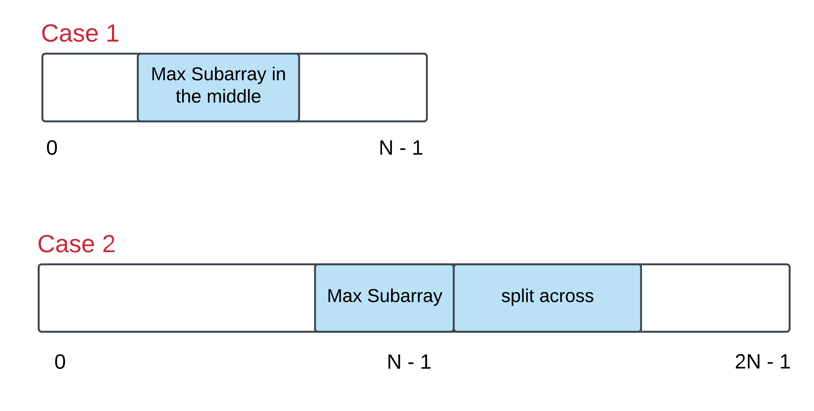

# [Maximum Sum Circular Subarray](https://leetcode.com/explore/challenge/card/may-leetcoding-challenge/536/week-3-may-15th-may-21st/3330/)

Given a circular array C of integers represented by A, find the maximum possible sum of a non-empty subarray of C.

Here, a circular array means the end of the array connects to the beginning of the array.  (Formally, C[i] = A[i] when 0 <= i < A.length, and C[i+A.length] = C[i] when i >= 0.)

Also, a subarray may only include each element of the fixed buffer A at most once.  (Formally, for a subarray C[i], C[i+1], ..., C[j], there does not exist i <= k1, k2 <= j with k1 % A.length = k2 % A.length.)
 

## Example 1:

        Input: [1,-2,3,-2]
        Output: 3
        Explanation: Subarray [3] has maximum sum 3

## Example 2:

        Input: [5,-3,5]
        Output: 10
        Explanation: Subarray [5,5] has maximum sum 5 + 5 = 10

## Example 3:

        Input: [3,-1,2,-1]
        Output: 4
        Explanation: Subarray [2,-1,3] has maximum sum 2 + (-1) + 3 = 4

## Example 4:

        Input: [3,-2,2,-3]
        Output: 3
        Explanation: Subarray [3] and [3,-2,2] both have maximum sum 3

## Example 5:

        Input: [-2,-3,-1]
        Output: -1
        Explanation: Subarray [-1] has maximum sum -1
 
## Note:

        -30000 <= A[i] <= 30000
        1 <= A.length <= 30000

### Hint #1  
        For those of you who are familiar with the Kadane's algorithm, think in terms of that. For the newbies, Kadane's algorithm is used to finding the maximum sum subarray from a given array. This problem is a twist on that idea and it is advisable to read up on that algorithm first before starting this problem. Unless you already have a great algorithm brewing up in your mind in which case, go right ahead!

### Hint #2  

        What is an alternate way of representing a circular array so that it appears to be a straight array? Essentially, there are two cases of this problem that we need to take care of. Let's look at the figure below to understand those two cases:

### Hint #3  
        The first case can be handled by the good old Kadane's algorithm. However, is there a smarter way of going about handling the second case as well?